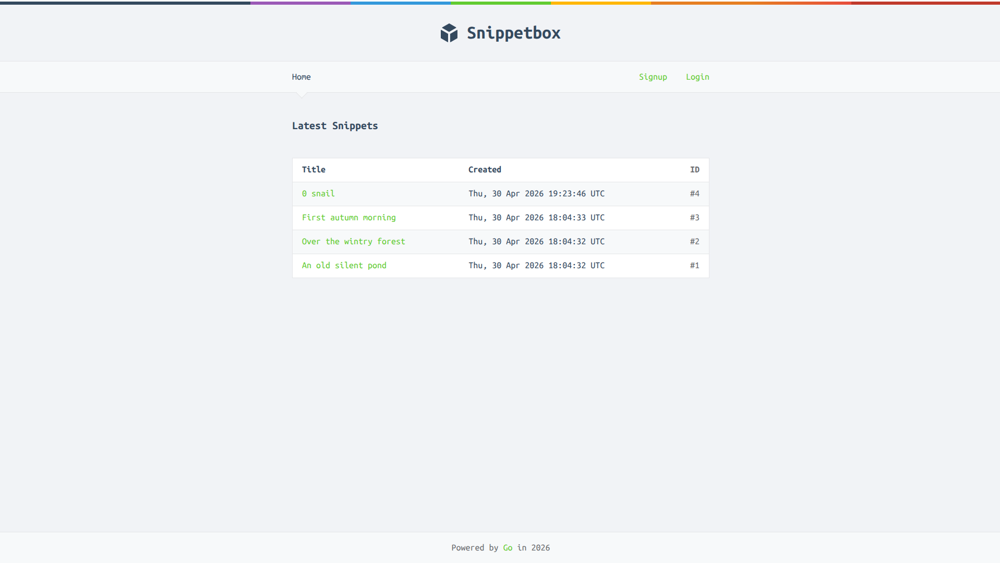

Snippetbox is a server-rendered web app to share snippets of text -- quotes, quick messages, notes, love letters?... -- with expiration. It's a build-along project from the book **Let's Go: A Step-By-Step Guide t Creating Fast, Secure, and Maintanable Web Applications in Go** [1](https://lets-go.alexedwards.net/) by [Alex Edward](https://github.com/alexedwards). I picked it up to learn the Go programming language and its conventional practices.

